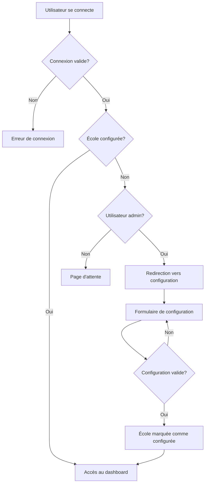

# 🏫 Guide de Configuration Multi-Écoles - Naklass

## Vue d'ensemble

Le système Naklass a été amélioré pour supporter plusieurs établissements scolaires avec une configuration obligatoire lors de la première utilisation. Ce guide explique comment mettre en place et utiliser cette fonctionnalité.

## 📋 Table des matières

1. [Installation et mise à jour](#installation-et-mise-à-jour)
2. [Configuration initiale d'une école](#configuration-initiale-dune-école)
3. [Fonctionnement du système](#fonctionnement-du-système)
4. [Gestion des utilisateurs](#gestion-des-utilisateurs)
5. [Dépannage](#dépannage)

## 🚀 Installation et mise à jour

### Prérequis
- Système Naklass déjà installé
- Accès administrateur à la base de données
- Navigateur web moderne

### Étapes d'installation

#### Option 1: Script principal (recommandé)
1. **Exécuter le script de mise à jour**
   ```
   Accédez à : http://votre-domaine/naklass/setup_school_management.php
   ```
   
2. **Vérifier l'installation**
   - Le script vérifie automatiquement la structure de la base de données
   - Ajoute les colonnes manquantes si nécessaire
   - Met à jour l'école de démonstration existante

#### Option 2: Script de secours (en cas de problème)
Si le script principal rencontre des erreurs :
1. **Exécuter le script de secours**
   ```
   Accédez à : http://votre-domaine/naklass/add_school_columns.php
   ```
   
2. **Avantages du script de secours**
   - Plus simple et direct
   - Gestion individuelle de chaque colonne
   - Messages d'erreur plus clairs
   - Compatible avec toutes les versions de MySQL

3. **Résultat attendu**
   - ✅ Toutes les colonnes nécessaires sont ajoutées
   - ✅ Index créés pour les performances
   - ✅ École de démonstration marquée comme configurée

## 🎯 Configuration initiale d'une école

### Première connexion administrateur

Quand un administrateur se connecte pour la première fois à une école non configurée :

1. **Redirection automatique** vers la page de configuration
2. **Formulaire de configuration** avec toutes les informations requises
3. **Validation** avant accès au système

### Informations requises

#### 📍 Informations générales
- **Nom complet** de l'école (obligatoire)
- **Sigle** de l'établissement (obligatoire)
- **Description** de l'établissement
- **Régime** : Public, Privé, ou Conventionné
- **Devise principale** : CDF, USD, ou EUR

#### 📧 Coordonnées
- **Adresse complète** (obligatoire)
- **Téléphone principal** (obligatoire)
- **Email principal** (obligatoire)
- Fax (optionnel)
- Boîte postale (optionnel)
- Site web (optionnel)

#### 📚 Configuration pédagogique
- **Types d'enseignement** (au moins un requis) :
  - Maternelle
  - Primaire
  - Secondaire
  - Technique
  - Professionnel
  - Université
  
- **Langues d'enseignement** (au moins une requise) :
  - Français
  - Anglais
  - Lingala
  - Kikongo
  - Tshiluba
  - Swahili

#### 👤 Direction
- **Nom complet du directeur** (obligatoire)
- **Téléphone du directeur** (obligatoire)
- Email du directeur (optionnel)

#### 📄 Autorisation officielle (optionnel)
- Numéro d'autorisation
- Date d'autorisation

### Validation du formulaire

Le système vérifie :
- ✅ Tous les champs obligatoires sont remplis
- ✅ Au moins un type d'enseignement sélectionné
- ✅ Au moins une langue d'enseignement sélectionnée
- ✅ Emails valides
- ✅ Cohérence des données

## ⚙️ Fonctionnement du système

### Workflow de connexion



### États d'une école

1. **Non configurée** (`configuration_complete = FALSE`)
   - Les admins sont redirigés vers la configuration
   - Les autres utilisateurs voient une page d'attente

2. **Configurée** (`configuration_complete = TRUE`)
   - Tous les utilisateurs accèdent normalement au système
   - Date de configuration enregistrée

### Protection des pages

Toutes les pages principales incluent maintenant :
```php
// Vérifier l'authentification
requireAuth(); // ou requireRole([...])

// Vérifier la configuration de l'école
requireSchoolSetup();
```

## 👥 Gestion des utilisateurs

### Rôles et permissions

| Rôle | Configuration école | Accès si non configurée |
|------|-------------------|----------------------|
| **Admin** | ✅ Peut configurer | Redirection auto vers config |
| **Direction** | ❌ Lecture seule | Page d'attente |
| **Enseignant** | ❌ Lecture seule | Page d'attente |
| **Secrétaire** | ❌ Lecture seule | Page d'attente |
| **Caissier** | ❌ Lecture seule | Page d'attente |

### Création de nouvelles écoles

1. **Ajouter l'école** dans la table `ecoles`
   ```sql
   INSERT INTO ecoles (nom, adresse, telephone, email, directeur_nom) 
   VALUES ('Nouvelle École', 'Adresse', 'Téléphone', 'email@ecole.cd', 'Directeur');
   ```

2. **Créer l'utilisateur admin**
   ```sql
   INSERT INTO utilisateurs (ecole_id, nom, prenom, email, mot_de_passe_hash, role_id) 
   VALUES (ID_ECOLE, 'Admin', 'Nom', 'admin@ecole.cd', 'HASH_PASSWORD', 1);
   ```

3. **Première connexion** : l'admin sera automatiquement redirigé vers la configuration

## 🔧 Dépannage

### Problèmes courants

#### L'admin ne peut pas accéder à la configuration
**Causes possibles :**
- Session corrompue
- Base de données non mise à jour
- Permissions incorrectes

**Solutions :**
1. Vider le cache/cookies du navigateur
2. Vérifier que `configuration_complete = FALSE` dans la table `ecoles`
3. Vérifier que l'utilisateur a le rôle 'admin'

#### Utilisateurs bloqués sur la page d'attente
**Cause :** École non configurée par l'admin

**Solution :** L'administrateur doit compléter la configuration

#### Erreur "fonction requireSchoolSetup() non trouvée"
**Cause :** Fichier `includes/functions.php` non mis à jour

**Solution :** Vérifier que les nouvelles fonctions sont bien ajoutées

### Commandes de diagnostic

```sql
-- Vérifier l'état des écoles
SELECT id, nom, configuration_complete, date_configuration FROM ecoles;

-- Vérifier les admins
SELECT u.nom, u.prenom, u.email, r.code, e.nom as ecole 
FROM utilisateurs u 
JOIN roles r ON u.role_id = r.id 
JOIN ecoles e ON u.ecole_id = e.id 
WHERE r.code = 'admin';

-- Forcer la reconfiguration d'une école
UPDATE ecoles SET configuration_complete = FALSE WHERE id = ID_ECOLE;
```

### Logs à vérifier

- **Connexions :** Table `user_actions` avec action 'LOGIN'
- **Configuration :** Action 'SCHOOL_SETUP'
- **Erreurs PHP :** Logs du serveur web

## 📊 Base de données

### Nouvelles colonnes dans `ecoles`

| Colonne | Type | Description |
|---------|------|-------------|
| `configuration_complete` | BOOLEAN | État de la configuration |
| `date_configuration` | DATE | Date de finalisation |
| `sigle` | VARCHAR(10) | Sigle de l'école |
| `site_web` | VARCHAR(255) | Site web |
| `fax` | VARCHAR(50) | Numéro de fax |
| `bp` | VARCHAR(100) | Boîte postale |
| `regime` | ENUM | Public/Privé/Conventionné |
| `type_enseignement` | SET | Types d'enseignement |
| `langue_enseignement` | SET | Langues d'enseignement |
| `devise_principale` | ENUM | CDF/USD/EUR |
| `directeur_telephone` | VARCHAR(20) | Téléphone directeur |
| `directeur_email` | VARCHAR(255) | Email directeur |
| `numero_autorisation` | VARCHAR(100) | N° autorisation |
| `date_autorisation` | DATE | Date autorisation |
| `description_etablissement` | TEXT | Description |

## 🎨 Interface utilisateur

### Page de configuration (`auth/school_setup.php`)
- Interface moderne et responsive
- Validation côté client et serveur
- Messages d'erreur clairs
- Sauvegarde automatique en cas d'erreur

### Page d'attente pour utilisateurs non-admin
- Message d'information clair
- Lien de déconnexion
- Design cohérent avec le reste de l'application

## 🚀 Fonctionnalités avancées

### Support multi-devises
- Configuration de la devise principale par école
- Impact sur les modules de paiement

### Support multi-langues d'enseignement
- Configuration flexible des langues
- Impact sur les bulletins et certificats

### Audit et traçabilité
- Toutes les modifications sont loggées
- Traçabilité complète des configurations

---

## 📞 Support

Pour toute question ou problème :
1. Vérifiez d'abord ce guide
2. Consultez les logs d'erreur
3. Testez les commandes de diagnostic
4. Contactez l'équipe de développement avec les détails de l'erreur

---

*Guide mis à jour le : $(date)*
*Version Naklass : 1.0.0 + Multi-écoles*
