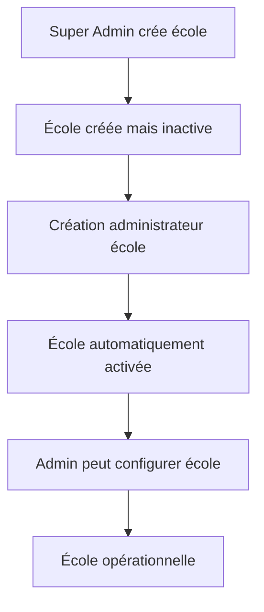
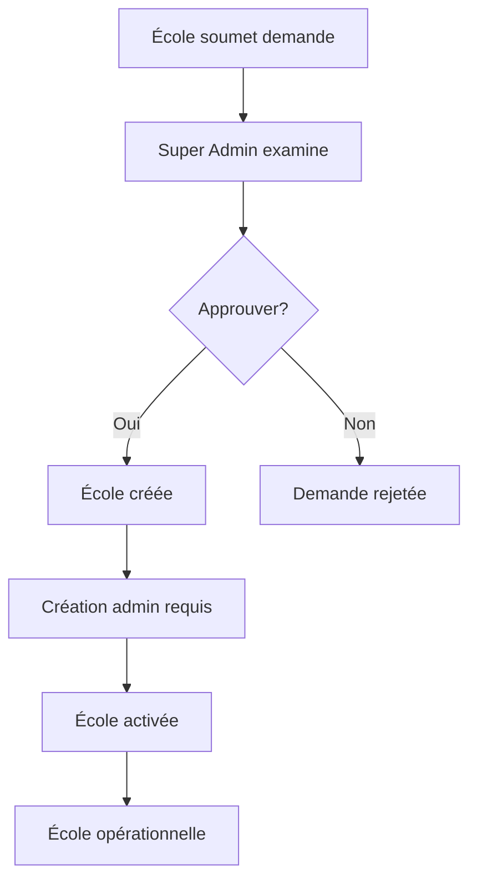

# 🛡️ Guide du Super Administrateur - Naklass

## Vue d'ensemble

Le système Super Administrateur de Naklass permet la gestion centralisée de plusieurs établissements scolaires. Le Super Admin est responsable de la création et de la supervision de toutes les écoles utilisant la plateforme.

## 📋 Table des matières

1. [Architecture du système](#architecture-du-système)
2. [Installation et configuration](#installation-et-configuration)
3. [Fonctionnalités du Super Admin](#fonctionnalités-du-super-admin)
4. [Workflow de création d'une école](#workflow-de-création-dune-école)
5. [Gestion des utilisateurs](#gestion-des-utilisateurs)
6. [Supervision multi-écoles](#supervision-multi-écoles)
7. [Sécurité et bonnes pratiques](#sécurité-et-bonnes-pratiques)

## 🏗️ Architecture du système

### Hiérarchie des rôles

```
Super Administrateur (niveau 0)
    ├── Accès à toutes les écoles
    ├── Création d'administrateurs d'école
    ├── Gestion des demandes d'inscription
    └── Supervision globale
    
    └── Administrateur d'École (niveau 1)
        ├── Gestion complète de son école
        ├── Création d'utilisateurs de son école
        └── Configuration de son établissement
        
        └── Utilisateurs École (niveau 2)
            ├── Direction
            ├── Enseignants  
            ├── Secrétaires
            └── Caissiers
```

### Structure de la base de données

#### Nouvelles tables :
- `demandes_inscription_ecoles` - Demandes d'inscription d'écoles
- Colonnes ajoutées à `utilisateurs` :
  - `is_super_admin` - Indicateur Super Admin
  - `niveau_acces` - Niveau hiérarchique
- Colonnes ajoutées à `ecoles` :
  - `activee` - École activée ou non
  - `date_activation` - Date d'activation
  - `activee_par` - ID du Super Admin qui a activé

## 🚀 Installation et configuration

### Étape 1: Exécuter le script d'installation

```bash
http://votre-site/naklass/setup_super_admin.php
```

### Étape 2: Vérifier l'installation

Le script crée automatiquement :
- ✅ Rôle Super Administrateur
- ✅ Utilisateur Super Admin par défaut
- ✅ Structure de base de données étendue
- ✅ Dossiers nécessaires
- ✅ Vues et index optimisés

### Étape 3: Accès Super Admin

**URL de connexion :** `/superadmin/login.php`  
**Email :** `superadmin@naklass.cd`  
**Mot de passe :** `SuperAdmin2024!`

⚠️ **IMPORTANT :** Changez ce mot de passe lors de la première connexion !

### Étape 4: Sécurisation (recommandé)

1. **Restriction par IP** - Éditez `/superadmin/.htaccess`
2. **Authentification HTTP Basic** - Double sécurité
3. **HTTPS obligatoire** - En production

## 🎛️ Fonctionnalités du Super Admin

### Tableau de bord principal (`/superadmin/index.php`)

#### Statistiques en temps réel :
- 📊 Nombre total d'écoles
- ✅ Écoles actives
- ⏳ Écoles en attente
- 📋 Demandes d'inscription
- 👥 Total utilisateurs

#### Actions rapides :
- ➕ Créer une nouvelle école
- 📋 Traiter les demandes d'inscription
- 🏫 Voir toutes les écoles
- 👑 Gérer les Super Admins
- 📈 Rapports globaux

### Gestion des écoles

#### Vue d'ensemble des écoles
- Statut d'activation
- Informations de l'administrateur
- Dernière connexion
- Actions disponibles

#### Création d'école
1. Informations générales
2. Coordonnées
3. Configuration pédagogique
4. Informations du directeur

### Gestion des demandes d'inscription

#### Workflow des demandes :
1. **Soumission** - École soumet sa demande
2. **Évaluation** - Super Admin examine
3. **Décision** - Approbation ou rejet
4. **Création** - École créée si approuvée
5. **Admin** - Création de l'administrateur
6. **Activation** - École devient opérationnelle

## 🔄 Workflow de création d'une école

### Méthode 1: Création directe par Super Admin



### Méthode 2: Via demande d'inscription



## 👥 Gestion des utilisateurs

### Création d'administrateur d'école

#### Interface : `/superadmin/users/create-admin.php`

**Informations requises :**
- École cible
- Nom et prénom
- Email (identifiant de connexion)
- Téléphone
- Mot de passe initial

**Processus automatique :**
1. Création de l'utilisateur avec rôle `admin`
2. Attribution du niveau `school_admin`
3. Association à l'école
4. Activation automatique de l'école
5. Notification des identifiants

### Règles de sécurité

- ✅ Un seul administrateur par école
- ✅ Email unique dans le système
- ✅ Mot de passe fort obligatoire
- ✅ Traçabilité complète des actions

## 🔍 Supervision multi-écoles

### Accès transversal

Le Super Admin peut :
- 👀 Voir toutes les données de toutes les écoles
- 📊 Générer des rapports consolidés
- 🔄 Basculer entre les écoles
- 🛠️ Intervenir en cas de problème

### Fonction `canAccessSchool($ecole_id)`

```php
// Super Admin peut accéder à toutes les écoles
if (isSuperAdmin()) {
    return true;
}

// Utilisateurs normaux : seulement leur école
return $_SESSION['ecole_id'] == $ecole_id;
```

### Rapports globaux

- 📈 Statistiques d'utilisation par école
- 💰 Revenus consolidés
- 👥 Nombre d'utilisateurs actifs
- 📚 Performance académique comparative

## 🔒 Sécurité et bonnes pratiques

### Sécurisation du compte Super Admin

1. **Mot de passe fort**
   - Minimum 12 caractères
   - Mélange majuscules/minuscules/chiffres/symboles
   - Changement régulier

2. **Authentification à deux facteurs** (recommandé)
   - Token mobile
   - SMS de vérification

3. **Restrictions d'accès**
   - Limitation par IP
   - Heures d'accès définies
   - Géolocalisation si applicable

### Protection du dossier `/superadmin/`

#### Configuration Apache (`.htaccess`)
```apache
# Restriction d'accès par IP
<RequireAll>
    Require ip 192.168.1.0/24
    Require ip 10.0.0.0/8
</RequireAll>

# Protection contre l'énumération
Options -Indexes
```

#### Configuration Nginx
```nginx
location /superadmin/ {
    allow 192.168.1.0/24;
    allow 10.0.0.0/8;
    deny all;
}
```

### Audit et logging

Toutes les actions Super Admin sont loggées :
- 📝 Création/modification d'écoles
- 👤 Création d'administrateurs
- ✅ Approbation/rejet de demandes
- 🔄 Basculement entre écoles
- 🚪 Connexions/déconnexions

### Sauvegarde et récupération

1. **Sauvegarde automatique**
   - Base de données complète quotidienne
   - Fichiers système hebdomadaire
   - Logs d'audit mensuels

2. **Plan de récupération**
   - Procédure de restauration documentée
   - Test régulier des sauvegardes
   - Site de secours si critique

## 📊 Monitoring et maintenance

### Indicateurs à surveiller

- 📈 Nombre de connexions par école
- ⚡ Performance du système
- 💾 Espace disque utilisé
- 🚨 Erreurs et exceptions
- 🔐 Tentatives de connexion échouées

### Maintenance régulière

#### Quotidienne :
- Vérification des logs d'erreur
- Contrôle des sauvegardes
- Monitoring des performances

#### Hebdomadaire :
- Analyse des statistiques d'usage
- Nettoyage des fichiers temporaires
- Mise à jour de sécurité

#### Mensuelle :
- Audit des comptes utilisateurs
- Révision des permissions
- Optimisation de la base de données

## 🔧 Dépannage

### Problèmes courants

#### Super Admin ne peut pas se connecter

**Causes possibles :**
- Mot de passe oublié
- Compte désactivé
- Restriction IP

**Solutions :**
```sql
-- Réinitialiser le mot de passe
UPDATE utilisateurs 
SET mot_de_passe_hash = '$2y$12$nouveauHash' 
WHERE is_super_admin = TRUE;

-- Réactiver le compte
UPDATE utilisateurs 
SET actif = TRUE 
WHERE is_super_admin = TRUE;
```

#### Écoles non visibles dans l'interface

**Vérifications :**
```sql
-- Vérifier les écoles
SELECT id, nom, statut, activee FROM ecoles;

-- Vérifier les permissions
SELECT is_super_admin, niveau_acces FROM utilisateurs 
WHERE id = 'ID_UTILISATEUR';
```

#### Erreurs de permissions

**Diagnostic :**
1. Vérifier `$_SESSION['is_super_admin']`
2. Contrôler `$_SESSION['niveau_acces']`
3. Tester la fonction `isSuperAdmin()`

## 📞 Support et assistance

### Contacts d'urgence

- **Support technique :** Équipe développement
- **Sécurité :** RSSI organisation
- **Base de données :** Administrateur BD

### Documentation technique

- Code source : Commenté et documenté
- API : Documentation Swagger/OpenAPI
- Base de données : Schéma détaillé

---

## 🎯 Checklist post-installation

- [ ] Script d'installation exécuté avec succès
- [ ] Mot de passe Super Admin changé
- [ ] Restrictions IP configurées
- [ ] Sauvegardes automatiques activées
- [ ] Logs d'audit fonctionnels
- [ ] Interface Super Admin accessible
- [ ] Première école de test créée
- [ ] Administrateur d'école test créé
- [ ] Processus de demandes testé
- [ ] Documentation équipe fournie

---

*Guide Super Administrateur - Naklass v1.0*  
*Dernière mise à jour : $(date)*
